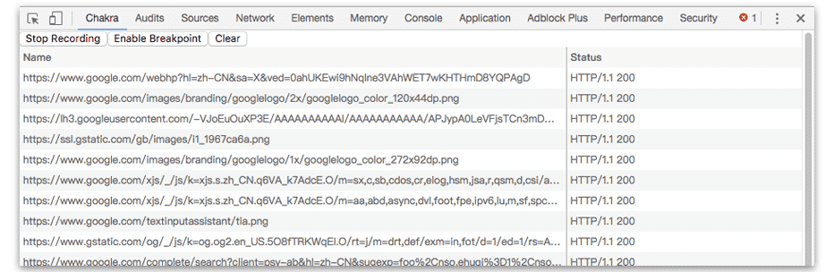

<i><b> This app is still in development stage </b></i>

# Chakra

Web debugging proxy application for Chrome

# TODO
- [X] Built for Chrome
- [X] Request recording
- [ ] Request breakpoint ( Haven't found available API :(
- [ ] Request Map

# License

MIT